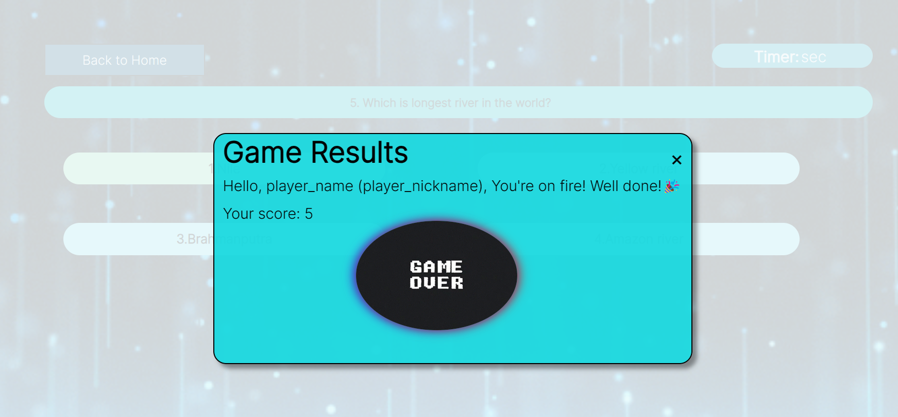

# Quiz Game 

deployed link: https://janhavi003.github.io/FewdCA2-Quiz/

Quiz game is a simple and fun game for 1 player. It is played in Question and Answer format. There will be questions appearing on your screen with 4 options and you have to choose correct option.

The game has different levels and after each level the difficulty level will increase. And for every correct answer scores will be incremented. 

If the player clicks wrong answer the correct answer will be displayed in green color while the score will not be incremented. After each level the scores will be displayed for every correct answer. 

There will be timer for each level if the player is unable to answer in that time period then the quiz will get over and scores will be shown.If the score of each level is less than the score required then player has to restart the game or else the game will move to new level.

There are three screen in this game:

Screen 1: Contains game logo, name,nickname of user.

Screen 2:  Instruction section, level selection.

Screen 3: Game screen - where the game is played, result.

Languages used are: HTML, CSS, JavaScript. 

Major features of this project:
1. This project is reponsive for desktop and mobile screens. 
2. Game has background music and sound effects. 
3. Game also has instruction section where rules of game and neccessary instructions are explained to player. 

Rules of Game are :
1. The objective of the quiz game is to test the knowledge of the participants on a variety of topics.
2. There will be 5 levels in this game. 
3. Each level will have 5 questions.
4. On choosing correct option your score will increase by 1 and on choosing incorrect option no points will be increased. 
5. the questions have to be answered in 20secs while timer being displayed above. 
6. At the end of the level, scoreboard will be visible with option of exiting or restarting the quiz if you score below 3 and if scored 3 or above you will have the option to exit or start new level.

- To store the name and nickname of user, JavaScript storage is been used. 
- To store score, Javascript storage is been used. 
- Different win and lose phrases will be shown at different times. 

Here are the screenshots of screens:

Home screen:

This is the starting page of the game where user has to enter their nickname and name. And on clicking the next button the instructions will appear.

Instructions and levels screen: 

This is the instructions page where the steps to play the game are been written for user. Also there is levels sections for user to select from. User can select any level and play. 

Game screen:

this is the game screen, where question will appear and user has to answer. There is also a back button for user to click to go back and select other level.

result:

This is the result box. Where user will be able to see their score with a winning or losing phrase based on their score and their name, nickname which they have to write on first/home page.

Websites and videos used for reference:
- w3schools.com
- youtube video: GreatStack- The quiz app. 
- background sound and sound effects: pixabay.com
- logo image: namelix.com
- gif and images: google images.

s

